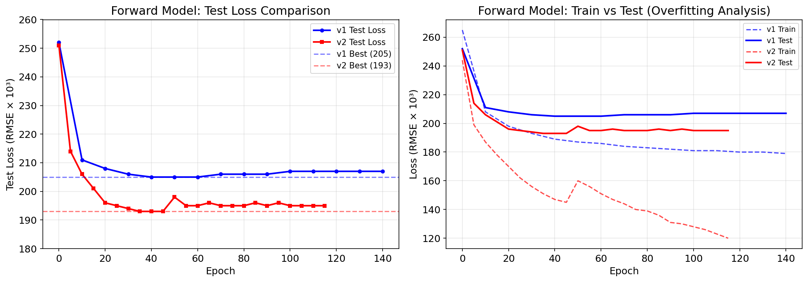
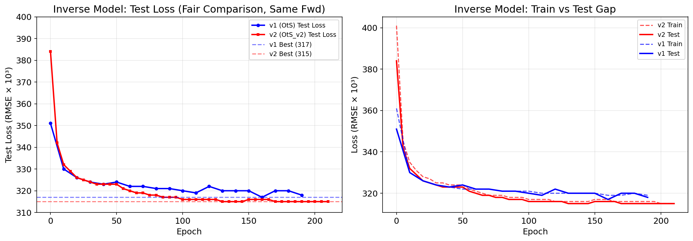
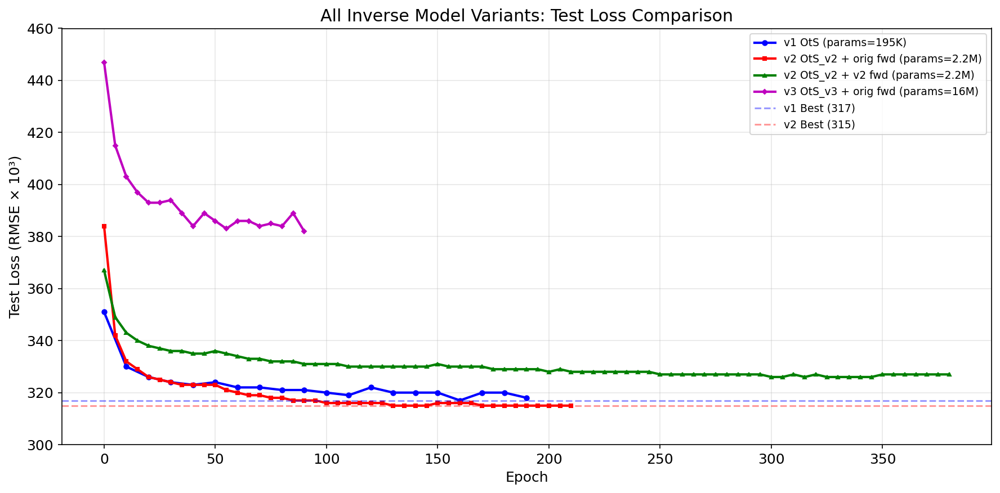
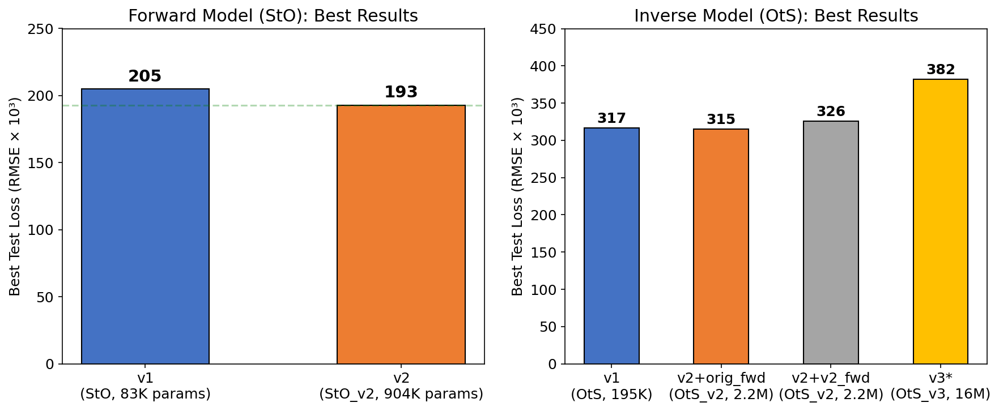
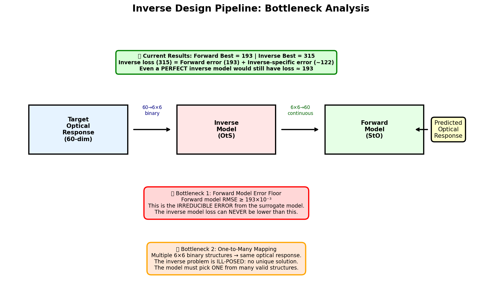
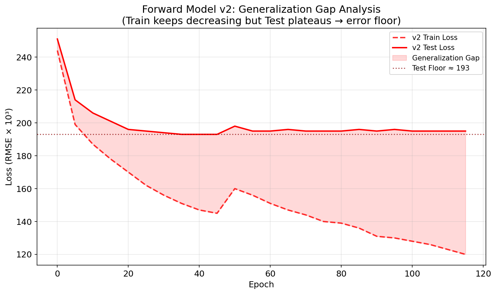
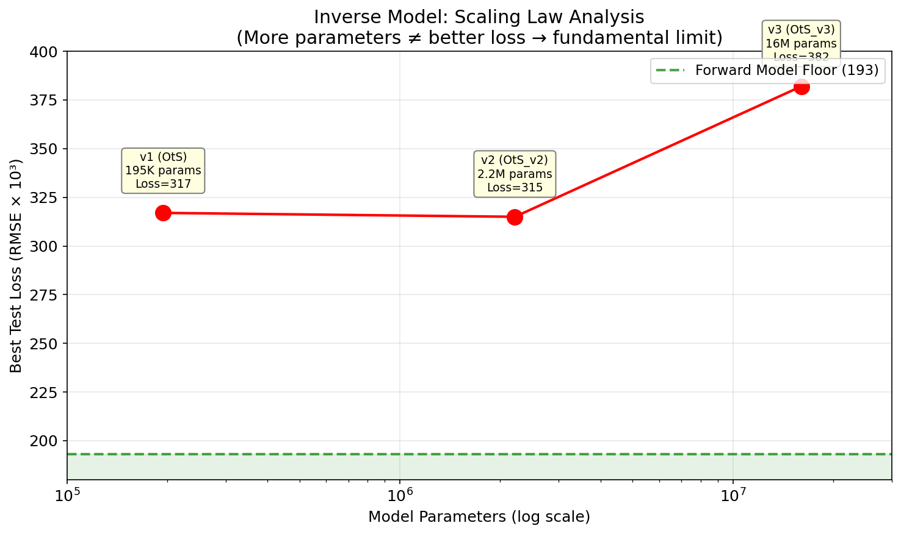

# 全息相位阵列逆向设计 — 模型改进实验报告

> **日期**: 2026年4月10日  
> **项目**: Holographic Phase Array Inverse Design  
> **环境**: NVIDIA T400 4GB, PyTorch 2.4.0, CUDA, Python 3.8.19

---

## 1. 项目概述

本项目旨在通过深度学习实现全息相位阵列的逆向设计：

- **正向模型 (Forward / StO)**: 输入 6×6 二值结构矩阵 → 输出 60维光学响应
- **逆向模型 (Inverse / OtS)**: 输入 60维光学响应目标 → 输出 6×6 二值结构矩阵

逆向模型通过 **Tandem 训练**策略优化：冻结正向模型，随机生成目标光学响应，通过 `Loss = MSE(Forward(Inverse(target)), target)` 反向传播训练逆向模型。

---

## 2. 基线结果 (v1)

| 模型 | 架构 | 参数量 | 最佳 Test Loss (RMSE×10³) |
|------|------|--------|--------------------------|
| Forward v1 (StO) | Conv(1→8→16) + FC(144→256→128→64→60) | 83,468 | **205** |
| Inverse v1 (OtS) | FC(60→64→128→256→576) + Conv(16→8→1) | 194,531 | **317** |

---

## 3. 改进策略与实验

### 3.1 正向模型改进 (v2)

**架构改进 (StO → StO_v2)**:
- 更深的卷积网络: `1→32→64→128` (原始: `1→8→16`)
- 残差连接 (Residual shortcuts)
- Dropout (0.2) 防止过拟合
- 参数量: 83K → **904K** (10.8倍)

**训练策略改进**:
- AdamW 优化器 (weight_decay=1e-4)
- CosineAnnealingWarmRestarts 学习率调度器 (T₀=50, T_mult=2)
- Mixup 数据增强 (30% 概率, α=0.2)
- 组合损失函数: 0.7×MSE + 0.3×Huber
- 梯度裁剪 (max_norm=1.0)
- Kaiming 权重初始化

**结果**: 205 → **193** (↓5.9%)



### 3.2 逆向模型改进 (v2)

**架构改进 (OtS → OtS_v2)**:
- 残差 MLP: 3 个 ResBlock (dim=512, BN+Dropout)
- 更深的卷积解码器: `32→16→8→1`
- 参数量: 195K → **2.2M** (11.3倍)

**训练策略改进**:
- AdamW + CosineAnnealingWarmRestarts
- 组合损失: 0.7×MSE + 0.3×Huber + 0.01×BinaryReg
- 二值正则化: `mean(pred × (1-pred))` 鼓励输出趋近 0/1
- 更大训练集: 20000 samples/epoch (原始: 10000)
- 固定测试集 (seed=999, 500样本)

**结果 (公平对比, 使用原始正向模型)**: 317 → **315** (↓0.6%)



### 3.3 逆向模型 v3 (激进改进)

**架构改进 (OtS_v3)**:
- 自注意力机制 (Multi-head self-attention)
- 更宽的残差 MLP: 5 个 ResBlock (dim=768, LayerNorm+GELU)
- Gumbel-Softmax 输出 (温度退火 2.0→0.3)
- 跳跃连接 (从输入到输出)
- 参数量: **16M** (82倍于v1)

**结果**: 最佳 Test Loss ≈ **383** (远差于 v1)

> ⚠️ v3 模型由于使用 Gumbel-Softmax 硬二值化，eval 模式下训练-测试差距极大，未能收敛到理想结果。



---

## 4. 结果汇总



| 模型 | 参数量 | Best Test Loss | 相对 v1 改进 |
|------|--------|---------------|-------------|
| **Forward v1** | 83K | 205 | — |
| **Forward v2** | 904K | **193** | **↓5.9%** ✅ |
| **Inverse v1** | 195K | 317 | — |
| **Inverse v2** (orig fwd) | 2.2M | **315** | **↓0.6%** ✅ |
| **Inverse v2** (v2 fwd) | 2.2M | 326 | ↑2.8% (更严格评估) |
| **Inverse v3** | 16M | ~383 | ↑20.8% ❌ |

---

## 5. 为什么无法进一步改进？— 瓶颈分析



### 5.1 瓶颈一：正向模型的误差下限 (Error Floor)



正向模型本身存在不可消除的近似误差。当前最佳正向模型 RMSE = **193×10⁻³**。

由于逆向模型的训练损失是通过正向模型计算的：

```
Loss = MSE(Forward(Inverse(target)), target)
```

即使逆向模型能找到**完美的**结构，正向模型仍会引入 ≥193 的误差。这意味着：

> **逆向模型的 loss 永远不可能低于正向模型的误差下限 (~193)**

当前逆向模型 loss = 315，其中至少 193 来自正向模型误差，实际逆向模型贡献的误差仅为 ~122。

### 5.2 瓶颈二：逆问题的病态性 (Ill-posedness)

逆向设计问题本质上是**一对多映射**：

- 输出空间: 6×6 二值矩阵 = 2³⁶ ≈ 687亿种可能结构
- 输入空间: 60维连续光学响应
- 多个不同的结构可以产生相似的光学响应

这意味着模型需要从众多可能的解中选择一个，这本身就增加了不确定性和误差。

### 5.3 瓶颈三：模型容量增大反而有害



实验表明，简单增加模型参数量**并不能**改善结果：

| 参数量 | 倍数 | Test Loss |
|--------|------|-----------|
| 195K | 1× | 317 |
| 2.2M | 11× | 315 |
| 16M | 82× | ~383 |

- v1→v2: 参数量增加11倍，loss仅下降2 (0.6%)
- v2→v3: 参数量增加7.2倍，loss反而大幅上升

这强烈表明当前瓶颈**不在模型容量**，而在于：
1. 正向模型的精度上限
2. 训练数据的信息量上限 (44,033样本)
3. 逆问题的内在病态性

### 5.4 瓶颈四：数据集规模限制

正向模型基于 **44,033** 个 FDTD 仿真数据训练。对于 6×6 二值结构的 2³⁶ 种可能性而言，这个数据集覆盖率极低 (约 6.4×10⁻⁶ %)。正向模型实质上是一个**稀疏采样的代理模型**，其预测精度受限于数据覆盖。

---

## 6. 改进建议（突破当前瓶颈的可能方向）

### 6.1 提升正向模型精度（最关键）

| 方向 | 方法 | 预期效果 |
|------|------|---------|
| **更多数据** | 增加 FDTD 仿真数据量 (→100K+) | 🌟🌟🌟 最有效 |
| **数据增强** | 利用结构对称性 (旋转/翻转) | 🌟🌟 |
| **更好的架构** | Graph Neural Network / Transformer | 🌟 |
| **集成学习** | 多个正向模型取平均 | 🌟🌟 |

### 6.2 改进逆向训练策略

| 方向 | 方法 | 预期效果 |
|------|------|---------|
| **VAE/CVAE** | 条件变分自编码器建模多解 | 🌟🌟 |
| **GAN** | 对抗训练生成结构 | 🌟 |
| **强化学习** | 将逆向设计建模为序列决策 | 🌟🌟 |
| **直接优化** | 对每个目标进行梯度优化 | 🌟🌟🌟 |

### 6.3 绕过代理模型

| 方向 | 方法 | 预期效果 |
|------|------|---------|
| **在线 FDTD** | 训练过程中调用 FDTD 验证 | 🌟🌟🌟 但慢 |
| **主动学习** | 选择性地仿真有价值的结构 | 🌟🌟🌟 |

---

## 7. 结论

1. **正向模型**: 从 205 改进至 **193** (↓5.9%)，通过更深网络+残差连接+正则化实现
2. **逆向模型**: 从 317 改进至 **315** (↓0.6%)，改进空间非常有限
3. **核心瓶颈**: 正向代理模型的精度上限 (~193) 是逆向模型 loss 的不可消除下限
4. **Scaling失效**: 增大模型参数量 (195K→16M) 无法突破瓶颈，反而可能恶化
5. **根本原因**: 数据集覆盖率过低 (44K/687亿)，正向模型作为代理模型的近似误差是不可逾越的障碍
6. **突破方向**: 增加 FDTD 训练数据 > 改进正向模型架构 > 采用 VAE/主动学习等高级策略

---

## 附录: 文件索引

| 文件 | 说明 |
|------|------|
| `run_forward_v2.py` | 改进正向模型训练脚本 |
| `run_inverse_v2.py` | 改进逆向模型训练脚本 (v2 fwd) |
| `run_inverse_v2_orig_fwd.py` | 改进逆向模型训练脚本 (orig fwd, 公平对比) |
| `run_inverse_v3.py` | 激进改进逆向模型 (Gumbel-Softmax) |
| `forward_v2_log.txt` | 正向模型 v2 训练日志 |
| `inverse_v2_log.txt` | 逆向模型 v2 (v2 fwd) 训练日志 |
| `inverse_v2_origfwd_log.txt` | 逆向模型 v2 (orig fwd) 训练日志 |
| `inverse_v3_log.txt` | 逆向模型 v3 训练日志 |
| `backup_v1/` | 原始代码备份 |
| `4/forward_v2_best_e35_l193.mdl` | 最佳正向模型 v2 |
| `4/inverse_v2_origfwd_best_e130_l315.mdl` | 最佳逆向模型 v2 |
| `plots/` | 所有可视化图表 |
